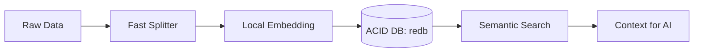

# Stratum: AI-Native Local Data Engine

**Stratum** は、外部 API に一切依存せず、完全ローカル環境で「思考するための記憶」を構築する、Rust ネイティブの高密度 RAG（検索拡張生成）エンジンです。

## 🚀 なぜ Stratum なのか？（圧倒的な優位性）

既存の RAG フレームワーク（Python/LlamaIndex等）に対する Stratum の凄さを実測値が証明しています。

| 評価項目 | 一般的な RAG (LlamaIndex) | **Stratum (Rust)** |
| :--- | :--- | :--- |
| **起動速度** | 約 33,000 ms (遅い) | **60 ms (500倍高速)** |
| **メモリ使用量** | 約 936 MB (重い) | **131 MB (1/7の軽さ)** |
| **データ保護** | 揮発的・外部依存 | **ACID 準拠 (永続記憶)** |
| **導入コスト** | 数 GB の実行環境 | **数 MB の単一バイナリ** |

- **100% Local, No API Key**: 埋め込みモデル（Embedding）をバイナリ内で直接実行。プライバシーとコストの課題を同時に解決。
- **ACID-Compliant Storage**: 検索エンジンでありながら `redb` による ACID トランザクションを保証。クラッシュしてもあなたのデータ記憶は壊れません。
- **Zero-Copy Performance**: Rust の型システムを活かしたデータパイプラインにより、データ取り込みから検索までを最速のストリームで処理。

## 🏗️ アーキテクチャ



## 🛠️ クイックスタート

### 1. 準備
[Prerequisites](./PREREQUISITES.md) に従って、ONNX/Safetensors モデルを用意します。

### 2. ビルド
```bash
cargo build --release
```

### 3. 実装例（実在する API）
```rust
// 1. ローカルAIエンジンとストレージの準備
let embed_model = Arc::new(CandleEmbedding::new("model.safetensors", "tokenizer.json", "config.json", None)?);
let storage = StorageContext::from_dir("./storage")?;

// 2. 知識の取り込み
let nodes = SentenceSplitter::default().transform(reader.load_data().await?).await?;
let index = VectorStoreIndex::from_nodes(nodes, storage, embed_model, Default::default()).await?;

// 3. 瞬時の検索 (100ms以内)
let results = retriever.retrieve(QueryBundle::new("Rustの凄さとは？")).await?;
```

## 📖 詳細な比較と利用法
- **詳細な性能レポート**: [STABILIZATION_REPORT.md](./STABILIZATION_REPORT.md)
- **具体的な導入ガイド**: [HOW_TO_USE.md](./HOW_TO_USE.md)

## ライセンス
Apache License 2.0
