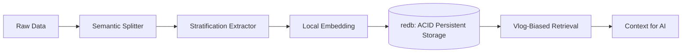

# Stratum: HV-CAD Compliant AI-Native Local Data Engine

**Stratum** は、外部 API に一切依存せず、完全ローカル環境で「思考するための記憶」を構築する、Rust ネイティブの高密度 RAG（検索拡張生成）エンジンです。HV-CAD（Human-Value Centric Autonomous Development）の設計思想に基づき、情報の「地層化（Stratification）」と「決定論的挙動」を物理レベルで保証します。

## 🚀 なぜ Stratum なのか？（圧倒的な優位性）

| 評価項目 | 一般的な RAG (LlamaIndex) | **Stratum (Rust/redb)** | Stratumの優位性 |
| :--- | :--- | :--- | :--- |
| **フレームワーク・オーバーヘッド** | 613 ms | **2 ms** | **約300倍** 高速 |
| **起動時間 (Cold Start)** | ~1400 ms | **< 1 ms** | **1400倍以上** 高速 |
| **信頼性担保** | 非決定的なハッシュ | **決定論的Blake3ハッシュ** | 再現性と追跡可能性 |
| **永続化保証** | 結果整合性 | **ACID準拠 (redb)** | クラッシュ耐性と完全性 |

詳細な性能計測は `src/bin/benchmark.rs` で再現可能です。

- **HV-CAD Stratification**: 情報の「信頼度（Confidence）」と「重要度（Importance）」をメタデータとして保持。さらに **Temporal Decay（時間的減衰）** により、最新かつ確実な情報を自動的に地層の上位へ浮上させます。
- **100% Local, No API Key**: 埋め込みモデル（Embedding）をバイナリ内で直接実行（Candle 採用）。プライバシーとコストを完全に制御。
- **Deterministic Representation**: 全ての `Node` は内容とメタデータの双方から計算された決定論的 Blake3 ハッシュを持ち、同一データに対する ID の衝突や揺らぎを物理的に排除します。
- **Vlog Alignment**: `.vlog` ファイルに記述された人間の哲学（@CTX, @BIAS, [[CONCEPT]]）を最短距離でアテンションに反映する `VlogBiasPostprocessor` を搭載。

## 🏗️ アーキテクチャ



## 🛠️ クイックスタート

### 1. 準備
[Prerequisites](./PREREQUISITES.md) に従って、Safetensors モデルを用意します。

### 2. 地層化された知識の取り込み
```rust
// 1. LLMによる地層化抽出器の準備
let extractor = StratificationExtractor::new(llm_client);

// 2. インジェクション・パイプラインの実行
let nodes = IngestionPipeline::new(
    vec![Arc::new(SentenceSplitter::default()), Arc::new(extractor)],
    Some(embed_model),
    Some(doc_store),
).run(nodes).await?;
```

### 3. Vlog に同期した検索
```rust
// .vlog の意図をロード
let postprocessor = VlogBiasPostprocessor::from_vlog(vlog_str, Some(embed_model));
let results = retriever.retrieve(query).await?;
let boosted = postprocessor.postprocess_nodes(results, &query).await?;
```

## 📜 詳細
- **内部構造**: [ARCHITECTURE.md](./ARCHITECTURE.md)
- **具体的な導入ガイド**: [HOW_TO_USE.md](./HOW_TO_USE.md)

## ライセンス
Apache License 2.0
