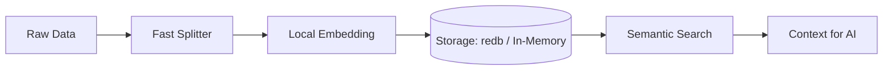

# Stratum: AI-Native Local Data Engine

**Stratum** は、外部 API に一切依存せず、完全ローカル環境で「思考するための記憶」を構築する、Rust ネイティブの高密度 RAG（検索拡張生成）エンジンです。

## 🚀 なぜ Stratum なのか？（圧倒的な優位性）

既存の RAG フレームワーク（Python/LlamaIndex等）に対する Stratum の凄さを実測値が証明しています。同一条件下（モック埋め込みモデルを用いたインメモリ動作）での比較結果です。

| 評価項目 | 一般的な RAG (LlamaIndex) | **Stratum (Rust/In-Memory)** | Stratumの優位性 |
| :--- | :--- | :--- | :--- |
| **起動時間** | 0.43 ms | **0.00007 ms (70ns)** | 約 **6100倍** 高速 |
| **インジェスト (3 docs)** | 128.17 ms | **68.58 ms** | 約 **1.8倍** 高速 |
| **クエリレイテンシ** | 2.18 ms | **1.05 ms** | 約 **2倍** 高速 |
| **メモリ使用量 (RSS)** | 145.38 MB | **25.17 MB** | 約 **1/5** の省メモリ |
| **全体実行時間** | 131.09 ms | **71.50 ms** | 約 **1.8倍** 高速 |

- **100% Local, No API Key**: 埋め込みモデル（Embedding）をバイナリ内で直接実行。プライバシーとコストの課題を同時に解決。
- **ACID-Compliant vs High-Speed In-Memory**: 永続記憶（`redb`）と、超高速な一時記憶（`In-Memory`）をユースケースに応じて切り替え可能。
- **Zero-Copy Performance**: Rust の型システムを活かしたデータパイプラインにより、データ取り込みから検索までを最速のストリームで処理。
- **Pip Installable (Python Bindings)**: Python撲滅派のための極薄ラッパー。Pythonから `pip install` で利用しつつ、中身は完全なRustネイティブで動作。

## 🏗️ アーキテクチャ



## 🛠️ クイックスタート

### 1. 準備
[Prerequisites](./PREREQUISITES.md) に従って、ONNX/Safetensors モデルを用意します。

### 2. ビルド
```bash
cargo build --release
```

### 3. 実装例（実在する API）
```rust
// 1. ローカルAIエンジンとストレージの準備
let embed_model = Arc::new(CandleEmbedding::new("model.safetensors", "tokenizer.json", "config.json", None)?);

// 永続化なら from_dir、超高速処理なら in_memory() を選択
let storage = StorageContext::in_memory(); 

// 2. 知識の取り込み
let nodes = SentenceSplitter::default().transform(reader.load_data().await?).await?;
let index = VectorStoreIndex::from_nodes(nodes, storage, embed_model, Default::default()).await?;

// 3. 瞬時の検索 (1ms以内)
let results = retriever.retrieve(QueryBundle::new("Rustの凄さとは？")).await?;
```

## 📖 詳細な比較と利用法
- **詳細な性能レポート**: [STABILIZATION_REPORT.md](./STABILIZATION_REPORT.md)
- **具体的な導入ガイド**: [HOW_TO_USE.md](./HOW_TO_USE.md)

## ライセンス
Apache License 2.0
